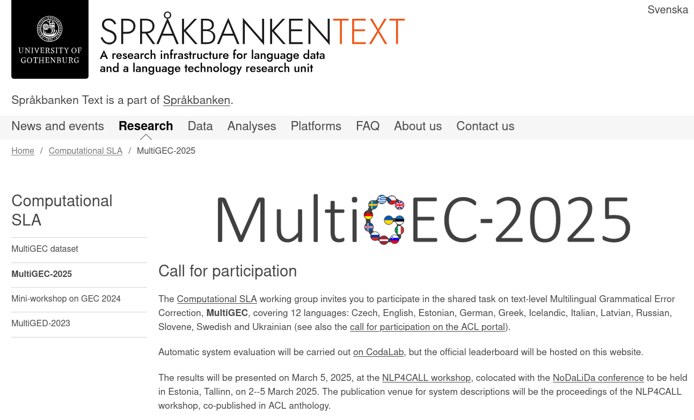
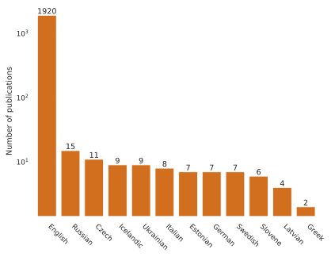
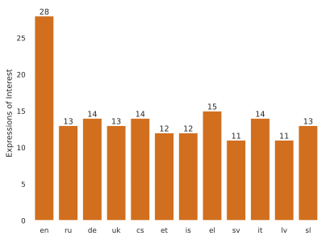
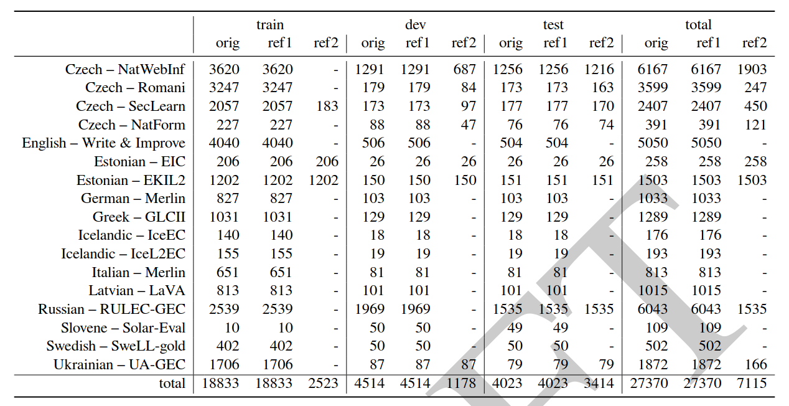
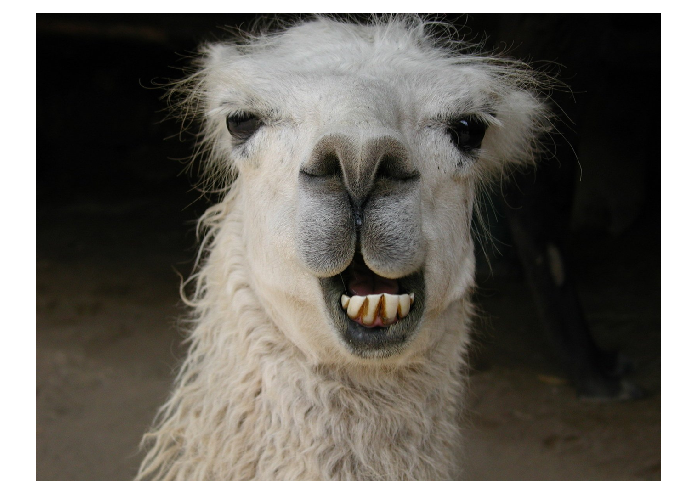
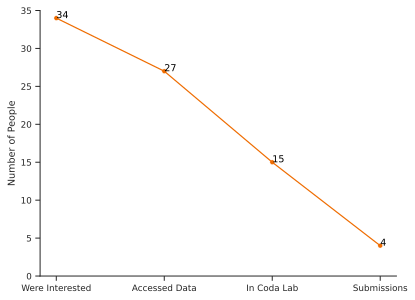

## What is GEC?
_Sequence-to-sequence task_ where:

- __input__: an (ungrammatical) text, typically written by a learner
- __output__: a normalized version of the same text, aka _correction hypothesis_, which can be
  - _minimal_ or
  - _fluency-edited_

## Example
\bigskip \bigskip

\footnotesize
| __original__ | __normalized (minimal)__ | __normalized (fluency)__ |
| --- | --- | --- |
| My moter became very sad, no food. | My _mother_ became very sad, _and ate_ no food. | My _mother_ _was_ very _sad and refused to eat_. |
| Min mama bliv väldigt ledsen, ingen mat. | Min _mamma_ _blev_ väldigt ledsen, _och åt ingen mat_. | Min _mamma_ _blev_ väldigt ledsen _och slutade äta_. |
| Mia mama era tanto triste, mangiava niente. | Mia _mamma_ era tanto triste _e_ _non_ mangiava niente. | Mia _madre_ era _molto_ triste e _aveva smesso di mangiare_. |
| Mi mama era tan triste, no comia. | Mi _mamá estaba muy_ triste, _no comía_.  | Mi _mamá estaba muy_ triste _y no comía nada_. 

## The shared task
\bigskip

## Why are we doing this?
\bigskip \bigskip

## Why are we doing this?
\bigskip \bigskip

## Why are we doing this?
\bigskip \bigskip \bigskip

## Why are we doing this?
\bigskip \bigskip \bigskip

## The shared task in numbers
- 12 languages and 18 subcorpora
- 8 organizers and 28 data providers
- 2 tracks (minimal + fluency)
- 3 evaluation metrics
- 1 multilingual baseline

## Dataset

TODO: this is just a temporary placeholder, the table should (only?) contain info about learners and domains

## Evaluation
- 2 __reference-based__ metrics (better for minimal edits):
  - $F_{0.5}$
  - GLEU
- Scribendi score (__referenceless__ and LM-based, better \newline for fluency edits)

## Baseline
\bigskip \bigskip 

## Participation
\bigskip \bigskip

## Results (non-random sample)
### Ukrainian (UA-GEC), "minimal edits" track

\footnotesize
| Rank | Team name | GLEU | P | R | __F0.5__ | Scribendi |
| -- | ------ | ---- | --- | --- | --- | ----- |
| __1__ | __UAM-CSI__ | __79.55__ | __74.31__ | __54.11__ | __69.15__ | __0.89__ |
| 2 | Lattice | 74.0 | 58.55 | 34.28 | 51.29 | 0.1 |
| 3 | baseline | 68.03 | 26.1 | 14.82 | 22.66 | 0.41 |
| 4 | Grammaticks | 62.93 | 16.53 | 13.48 | 15.81 | -0.1 |
| 5 | Rum-Cull | 65.38 | 3.15 | 1.18 | 2.36 | 0.62 |

For the complete results, see [`spraakbanken.gu.se/compsla/multigec-2025`](https://spraakbanken.gu.se/compsla/multigec-2025)

## Results (overview)
TODO: Up for discussion how to best visually summarize them (we will need something like this in the paper as well), I have some ideas we can talk about one of these days but not sure they're any good.

## What's next?
- open phase of the shared task (ongoing)
- presentation of the results at the NLP4CALL workshop
- manual evaluation of system output