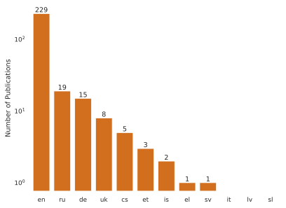

## What is GEC?
Grammatical Error Correction is _sequence-to-sequence task_ where:

- __input__: an (ungrammatical) text, typically written by a learner
- __output__: a normalized version of the same text, aka _correction hypothesis_, which can be
  - _minimal_ or
  - _fluency-edited_

## Example
\bigskip \bigskip

\footnotesize
| __original__ | __normalized (minimal)__ | __normalized (fluency)__ |
| --- | --- | --- |
| My moter became very sad, no food. | My _mother_ became very sad, _and ate_ no food. | My _mother_ _was_ very _sad and refused to eat_. |
| Min mama bliv väldigt ledsen, ingen mat. | Min _mamma_ _blev_ väldigt ledsen, _och åt ingen mat_. | Min _mamma_ _blev_ väldigt ledsen _och slutade äta_. |
| Mia mama era tanto triste, mangiava niente. | Mia _mamma_ era tanto triste _e_ _non_ mangiava niente. | Mia _madre_ era tanto triste _che aveva smesso di mangiare_. |
| Mi mama era tan triste, no comia. | Mi _mamá estaba muy_ triste, _no comía_.  | Mi _mamá estaba muy_ triste _y no comía nada_. 

## Why multilingual?
\bigskip \bigskip \bigskip

## Why multilingual?
\bigskip \bigskip \bigskip

## Why multilingual?
\bigskip \bigskip

## Why multilingual?
\bigskip \bigskip

## The shared task
\bigskip

## Dataset
\def\checkmark{\tikz\fill[scale=0.3](0,.35) -- (.25,0) -- (1,.7) -- (.25,.15) -- cycle;} 

\bigskip \bigskip

\tiny
| __lang__ | __subcorpus__       | __n. essays__ | __learners__                | __minimal__ | __fluency__ | __peculiarities__                                     |
|--:|:----------------|-------------:|:-----------------------------------|:--------|:--------|:----------------------------------------------|
| cs   | NatWebInf |      6167 | __L1__ (web)               | \checkmark |            |                                                  |
| cs   | Romani    |      3599 | __L1__ (Romani background) | \checkmark |            |                                                  |
| cs   | SecLearn  |      2407 | __L2__                     | \checkmark |            |                                                  |
| cs   | NatForm   |       391 | __L1__ (students)          | \checkmark |            |                                                  |
| en   | Write & Improve |      5050 | __L2__                     | \checkmark |            | separate download                                |
| et   | EIC             |       258 | __L2__                     | \checkmark | \checkmark |                                                  |
| et   | EKIL2           |      1503 | __L2__                     |            | \checkmark |                                                  |
| de   | Merlin          |      1033 | __L2__                     | \checkmark |            |                                                  |
| el   | GLCII           |      1289 | __L2__                     | \checkmark |            |                                                  |
| is   | IceEC           |       176 | __L1__                     |            | \checkmark | pre-tokenized                                    |
| is   | IceL2EC         |       193 | __L2__                     |            | \checkmark | pre-tokenized; text fragments                    |
| it   | Merlin          |       813 | __L2__                     | \checkmark |            |                                                  |
| lv   | LaVA            |      1015 | __L2__                     | \checkmark |            |                                                  |
| ru   | RULEC-GEC       |      6043 | __mixed__ (L2 + heritage)  | \checkmark | \checkmark | pre-tokenized; text fragments; separate download |
| sl   | Solar-Eval      |       109 | __L1__ (students) | \checkmark |            |                                                  |
| sv   | SweLL_gold      |       502 | __L2__                     | \checkmark |            |                                                  |
| uk   | UA-GEC          |      1872 | __mixed__ (crowdsourced)   | \checkmark | \checkmark |                                                  |

## Evaluation
- 2 __reference-based__ metrics (better for minimal edits):
  - $F_{0.5}$
  - GLEU
- Scribendi score (__referenceless__ and LM-based, better \newline for fluency edits)

## Baseline
\bigskip \bigskip 

## Participation
\bigskip \bigskip

## Results (non-random sample)
### Ukrainian (UA-GEC), "minimal edits" track

\footnotesize
| Rank | Team name | GLEU | P | R | __F0.5__ | Scribendi |
| -- | ------ | ---- | --- | --- | --- | ----- |
| __1__ | __UAM-CSI__ | __79.55__ | __74.31__ | __54.11__ | __69.15__ | __0.89__ |
| 2 | Lattice | 74.0 | 58.55 | 34.28 | 51.29 | 0.1 |
| 3 | baseline | 68.03 | 26.1 | 14.82 | 22.66 | 0.41 |
| 4 | Grammaticks | 62.93 | 16.53 | 13.48 | 15.81 | -0.1 |
| 5 | Rum-Cull | 65.38 | 3.15 | 1.18 | 2.36 | 0.62 |

For the complete results, see [`spraakbanken.gu.se/compsla/multigec-2025`](https://spraakbanken.gu.se/compsla/multigec-2025)

## Overview ("minimal edits" track)
\bigskip \bigskip

## Overview ("fluency edits" track)
\bigskip \bigskip

## What's next?
- open phase of the shared task (ongoing)
- presentation of the results at the NLP4CALL workshop
- manual evaluation of system output
- exploration of new ways to do automated evaluation