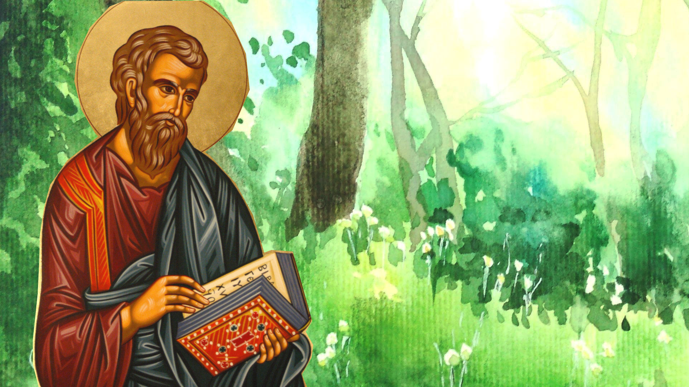

## The shared task in short

\smallskip

- Grammatical Error Correction (GEC)
- multilingual (12 European languages)
- text-level
- two tracks:
  1. "minimal edits"
  2. "fluency edits"

## What is GEC?
Grammatical Error Correction is _sequence-to-sequence task_ where:

- __input__: a text, potentially ungrammatical, typically written by a learner
- __output__: a normalized version of the same text, aka _correction hypothesis_, which can be
  - _minimal_ or
  - _fluency-edited_

## Example
\bigskip \bigskip

\footnotesize
| __original__ | __normalized (minimal)__ | __normalized (fluency)__ |
| --- | --- | --- |
| My moter became very sad, no food. | My _mother_ became very sad, _and ate_ no food. | My _mother_ _was_ very _sad and refused to eat_. |
| Min mama bliv väldigt ledsen, ingen mat. | Min _mamma_ _blev_ väldigt ledsen, _och åt ingen mat_. | Min _mamma_ _blev_ väldigt ledsen _och slutade äta_. |
| Mia mama era tanto triste, mangiava niente. | Mia _mamma_ era tanto triste _e_ _non_ mangiava niente. | Mia _madre_ era tanto triste _che aveva smesso di mangiare_. |
| Mi mama era tan triste, no comia. | Mi _mamá estaba muy_ triste, _no comía_.  | Mi _mamá estaba muy_ triste _y no comía nada_. 

(in the shared task, this is done at the level of full texts)

## Why multilingual?
\bigskip \bigskip \bigskip

## Why multilingual?
\bigskip \bigskip \bigskip

## Why multilingual?
\bigskip \bigskip

## Why multilingual?
\bigskip \bigskip

## The MultiGEC dataset
\def\checkmark{\tikz\fill[scale=0.3](0,.35) -- (.25,0) -- (1,.7) -- (.25,.15) -- cycle;} 

\bigskip \bigskip

\tiny
| __lang__ | __subcorpus__       | __n. essays__ | __learners__                | __minimal__ | __fluency__ | __peculiarities__                                     |
|--:|:----------------|-------------:|:-----------------------------------|:--------|:--------|:----------------------------------------------|
| cs   | NatWebInf |      6167 | __L1__ (web)               | \checkmark |            |                                                  |
| cs   | Romani    |      3599 | __L1__ (Romani background) | \checkmark |            |                                                  |
| cs   | SecLearn  |      2407 | __L2__                     | \checkmark |            |                                                  |
| cs   | NatForm   |       391 | __L1__ (students)          | \checkmark |            |                                                  |
| en   | Write & Improve |      5050 | __L2__                     | \checkmark |            | separate download                                |
| et   | EIC             |       258 | __L2__                     | \checkmark | \checkmark |                                                  |
| et   | EKIL2           |      1503 | __L2__                     |            | \checkmark |                                                  |
| de   | Merlin          |      1033 | __L2__                     | \checkmark |            |                                                  |
| el   | GLCII           |      1289 | __L2__                     | \checkmark |            |                                                  |
| is   | IceEC           |       176 | __L1__                     |            | \checkmark | pre-tokenized                                    |
| is   | IceL2EC         |       193 | __L2__                     |            | \checkmark | pre-tokenized; text fragments                    |
| it   | Merlin          |       813 | __L2__                     | \checkmark |            |                                                  |
| lv   | LaVA            |      1015 | __L2__                     | \checkmark |            |                                                  |
| ru   | RULEC-GEC       |      6043 | __mixed__ (L2 + heritage)  | \checkmark | \checkmark | pre-tokenized; text fragments; separate download |
| sl   | Solar-Eval      |       109 | __L1__ (students) | \checkmark |            |                                                  |
| sv   | SweLL_gold      |       502 | __L2__                     | \checkmark |            |                                                  |
| uk   | UA-GEC          |      1872 | __mixed__ (crowdsourced)   | \checkmark | \checkmark |                                                  |

## Baseline
\bigskip \bigskip 

## Automatic evaluation

\small

| __metric__ | __characteristics__ | 
| --- | ----- |
| ERRANT-based $F_{0.5}$ score | reference-based; winning metric for __track 1__ |
| GLEU score | rewards fluency, but still reference-based | 
| Scribendi score | reference-free (LM[^1]-based); winning metric for __track 2__ | 

\...all adapted to work on __full texts__ in all __12 languages__! 

[^1]: Gemma 2

## System submissions

\footnotesize

| __team__ | __languages__ | __track 1__ | __track 2__ | __system__ |
| --- | -- | -- | -- | ------- |
| UAM-CSI | all 12 |  \checkmark | \checkmark | fine-tuned Gemma 2 |
| Lattice | 11 | \checkmark | | fine-tuned LlaMA 3 | 
| Lattice | Slovene | \checkmark | | XLM-RoBERTa pipeline  |
| Rum-Cull | all 12 |  \checkmark | \checkmark | ? | 
| Grammaticks | Ukrainian | \checkmark | | ? |

## Results (track 1)
\bigskip \bigskip

## Results (track 2)
\bigskip \bigskip

## GLEU scores (track 1)
\bigskip \bigskip

## GLEU scores (track 2)
\bigskip \bigskip

## Manual evaluation (preliminary)
- 5 languages (English, German, Italian, Russian and Swedish)
- manual inspection of all outputs for one challenging essay per language
- confirms the ranking
- further work needed to know the extent to which scores are cross-lingually comparable

## Key takeaways
- the overall winner is team UAM-CSI <!--across tracks, languages and evaluation metrics-->
- in track 1, team Lattice ranks second for most languages
- the baseline was harder to beat than expected
- some languages (Icelandic & Russian) proved extra challenging for all models

## Reflections
__4__ submissions vs. (~__40 + 10__) requests for access to the dataset. How to favor broader participation? \pause

- __timeline__: longer development phase, shorter test phase \pause
- __baseline__: LLM baselines may discourage submissions of supervised system \pause
- __dataset__: 
  - number of languages/subcorpora vs. ease of access 
  - test sets: to release or not to release? \pause
- __evaluation__: advanced metrics vs. practical constraints

## The future
- __dataset__:
  - v1.1 enhancing cross-subcorpus consistency
  - extension of MultiGEC with additional references and/or new languages
- __evaluation__:
  - larger-scale manual assessment of shared task submissions
  - further work on cross-lingually applicable metrics 
  - further automation
- __new MultiGEC systems__ during the task's open phase

## To learn more about\...

\bigskip\smallskip

- \small __the state of GEC in the 12 MultiGEC languages prior to the shared task__: A. Masciolini, A. Caines, O. De Clercq, J. Kruijsbergen, M. Kurfalı, R. Muñoz Sánchez, E. Volodina, R. Östling, K. Allkivi, Š. Arhar Holdt, I. Auzina, R. Dargis, E. Drakonaki, J. Frey, I. Glišić, P. Kikilintza, L. Nicolas, M. Romanyshyn, A. Rosen, A. Rozovskaya, K. Suluste, O. Syvokon, A. Tantos, D. Touriki, K. Tsiotskas, E. Tsourilla, V. Varsamopoulos, K. Wisniewski, A. Žagar, and T. Zesch. _An overview of Grammatical Error Correction for the twelve MultiGEC-2025 languages_. Gothenburg, Sweden, 2025
- \small __the shared task__: A. Masciolini, A. Caines, O. De Clercq, J. Kruijsbergen, M. Kurfalı, R. Muñoz Sánchez, E. Volodina, and R. Östling. _The MultiGEC-2025 shared task on Multilingual Grammatical Error Correction at NLP4CALL_. In R. Muñoz Sánchez, David Alfter, Jelena Kallas, and E. Volodina, editors, Proceedings of the 14th Workshop on Natural Language Processing for Computer Assisted Language Learning, Tallin, Estonia, 2025

## To learn more about\...
- \small __the MultiGEC dataset__: 
  - \small __paper__: A. Masciolini, A. Caines, O. De Clercq, J. Kruijsbergen, M. Kurfalı, R. Muñoz Sánchez, E. Volodina, R. Östling, K. Allkivi, Š. Arhar Holdt, I. Auzina, R. Dargis, E. Drakonaki, J. Frey, I. Glišić, P. Kikilintza, L. Nicolas, M. Romanyshyn, A. Rosen, A. Rozovskaya, K. Suluste, O. Syvokon, A. Tantos, D. Touriki, K. Tsiotskas, E. Tsourilla, V. Varsamopoulos, K. Wisniewski, A. Žagar, and T. Zesch. _Towards better language representation in Natural Language Processing – a multilingual dataset for text-level Grammatical Error Correction_. To appear in the International Journal of Learner Corpus Research, 2025
  - \small __dedicated website__: \underline{\url{spraakbanken.github.io/multigec-2025}}
  - \small __resource page__: \underline{\url{doi.org/10.23695/h9f5-8143}}
  - \small __download__: \underline{\url{lt3.ugent.be/resources/multigec-dataset}}

## Thanks to
